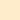

# Ballerini Theme
Dark Brown Theme with pastel colors created by Ballerini Community
## Themes
Ballerini Theme currently support 1 application. You can find them below:
### Developer Tools
* [Visual Studio Code](https://github.com/Ballerini-Theme/visual-studio-code)
### Browsers
* [Google Chrome](https://github.com/Ballerini-Theme/google-chrome)
### Terminals
* [Alacritty](https://github.com/Ballerini-Theme/alacritty)
* [Kitty](https://github.com/Ballerini-Theme/kitty)

if you want to create a new theme based on our palette, [check our guide](https://github.com/Ballerini-Theme/ballerini-theme/blob/main/CONTRIBUTING.md).
## Color Palette

Palette        | Hex       | RGB           | HSL               | Preview
---            | ---       | ---           | ---               | ---
Background     | `#261C1E` | `38 28 30`    | `348° 15% 13%`    |
Current Line   | `#3A2624` | `58 38 36`    | `5° 23% 18%`      |
Selection      | `#583c38` | `88 60 56`    | `7° 22% 28%`      |
Foreground     | `#FFF2E7` | `255 242 231` | `27° 100% 95%`    |
Foreground Alt | `#FEECCB` | `254 236 203` | `39° 96% 90%`     |
Comment        | `#8E646B` | `142 100 107` | `350° 17% 47%`    |
Pastel Blue    | `#97D4D9` | `151 212 217` | `185° 46% 72%`    |
Pastel Pink    | `#feafbe` | `254 175 190` | `349° 98% 84%`    |
Pastel Green   | `#B3DFD3` | `179 223 211` | `164° 41% 79%`    |
Pastel Yellow  | `#EFC764` | `239 199 100` | `43° 81% 66%`     |
Red Orange     | `#A45A49` | `162 89 73`   | `11° 38% 46%`     |
Light Red      | `#E68E7B` | `230 142 123` | `11° 68% 69%`     |
Pink Red       | `#E94554` | `233 69 84`   | `355° 79% 59%`    |
Dark Brown     | `#2F2325` | `47 35 37`    | `350° 15% 16%`    |
Green          | `#67E480` | `103 228 128` | `132° 70% 65%`    |
Cyan           | `#55EDC4` | `85 237 196`  | `164° 81% 63%`    |

## Team
Initially, the Ballerini Theme was created by [Alpha Vylly](https://github.com/AlphaLawless), inspired by [Ballerini Community's brand guide](https://github.com/Ballerini-Server/BrandGuide). And currently we are looking for people to create a team, to keep theme updates for other plataforms.
## Credits
The structure of Ballerini Theme was initially created [Yo Code](https://vscode.readthedocs.io/en/latest/extensions/yocode/), with the help of [Themes VSCode One](https://themes.vscode.one) for the prototype. And later came to be created a structure inspired by [Dracula](https://github.com/dracula) and [Omni](https://github.com/getomni).

## License

[MIT License](./LICENSE)
